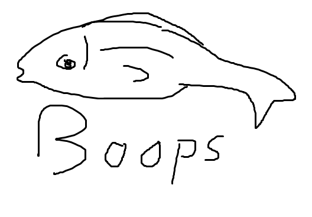

 __Estructura GDD :__ 
 
 

# 1.- Índice

+ __[2.- Introducción](#intro)__
	+ __[2.1 Concepto del juego](#game_concept)__
	+ __[2.2 Características principales](#main_features)__
	+ __[2.3 Género](#genre)__
	+ __[2.4 Propósito y público objetivo](#target)__
	+ __[2.5 Jugabilidad (idea básica)](#basic_gameplay)__
	+ __[2.6 Estilo visual](#visual_style)__
	+ __[2.7 Alcance](#reach)__
+ __[3.- Mecánicas de juego](#mechanics)__
	+ __[3.1 Jugabilidad (en profundidad)](#gameplay)__
	+ __[3.2 Flujo de juego](#game_flow)__
	+ __[3.3 Personajes](#characters)__
	+ __[3.4 Movimiento](#movement)__
+ __[4.- Interfaz](#interface)__

+ __[5. Arte](#art)__
+ __[6. Historial de versiones](#changelog)__

# 2.- Introducción

Este es el documento de diseño de Punch'em Up!, un videojuego de navegador.
	
+ ##  2.1 Concepto del juego	

Juego arcade para todos los públicos en el que el objetivo será conseguir la máxima puntuación.
En un puente dos rivales se encuentran y tú quieres evitarlo. Juega como dos puños de madera gigantes que se encarguen del trabajo.
	
+ ## 2.2 Características principales		
	
El juego se desarrolla en un puente con dos puños hidraulicos gigantes en el fondo. Se tendrá que tirar a todos los personajes que pasen sin que crucen al otro lado.
	
+ ## 2.3 Género	
	
Arcade
	
+ ## 2.4 Propósito y público objetivo
	
El propósito general del juego es entretener durante un breve periodo de tiempo para no requerir una dedicación a los jugadores 
y poder abarcar un mayor número de audiencia.

Para todos los públicos, pero enfocado al público joven

+ ## 2.5 Jugabilidad(idea básica)
	
Tú manejas a dos puños gigantes y tienes que evitar que distintos personajes crucen un puente golpeando en el momento preciso.
	
+ ## 2.6 Estilo visual	
	
Por decidir
	
+ ## 2.7 Alcance
	
Se trata de un divertido juego para navegadores con un sistema de monetización para el apartado visual.

# 3.- Mecánicas de juego

+ ## 3.1 Jugabilidad (en profundidad)	
	
Varios personajes atravesarán el puente. Al pasar por delante de los puños, se pueden activar para tirar a los personajes fuera 	del puente.
El objetivo del juego es evitar que los personajes crucen el puente. Cuantos más personajes sean tirados, mayor será la 		puntuación.
El juego acaba tras dejar cruzar el puente a demasiados personajes.
El juego auméntara la dificultad según avance el tiempo, siendo más rápidas las oleadas de personajes cruzando y con distintos 		tipos de personajes. También se abrirá el otro lado del puente, pudiendo los personajes cruzar de izquierda a derecha y 		viciversa. 
	
+ ## 3.2 Flujo de juego	
	
*POR HACER*

+ ## 3.3 Personajes		
	
Mago normal y Caballero Normal
Sin habilidades especiales
	
Jinetes (Magos y Caballeros)
Se mueven más rápido
	
Caballero Gigante
Necesita más golpes que un caballero normal
	
Brujo
Se teletransporta a la mitad del mapa

+ ## 3.4 Movimiento
	
Los personajes se moverán de un lado al otro del puente. Los puños solo se mueven hacia el jugador para tirar a los personajes.

# 4.- Interfaz

+ ## 4.1 Diagrama de flujo	
*POR HACER*
+ ## 4.2 Menú principal
*POR HACER*
+ ## 4.3 Créditos	
*POR HACER*
+ ## 4.4 Selección de perfil
*POR HACER*
+ ## 4.5 Selección de nivel	
*POR HACER*
+ ## 4.6 Fin del nivel
*POR HACER*

# 5.- Arte 

# 6.- Historial de versiones
+ (24/09/2019) Estructura básica de código

