 __Estructura GDD :__ 
 

  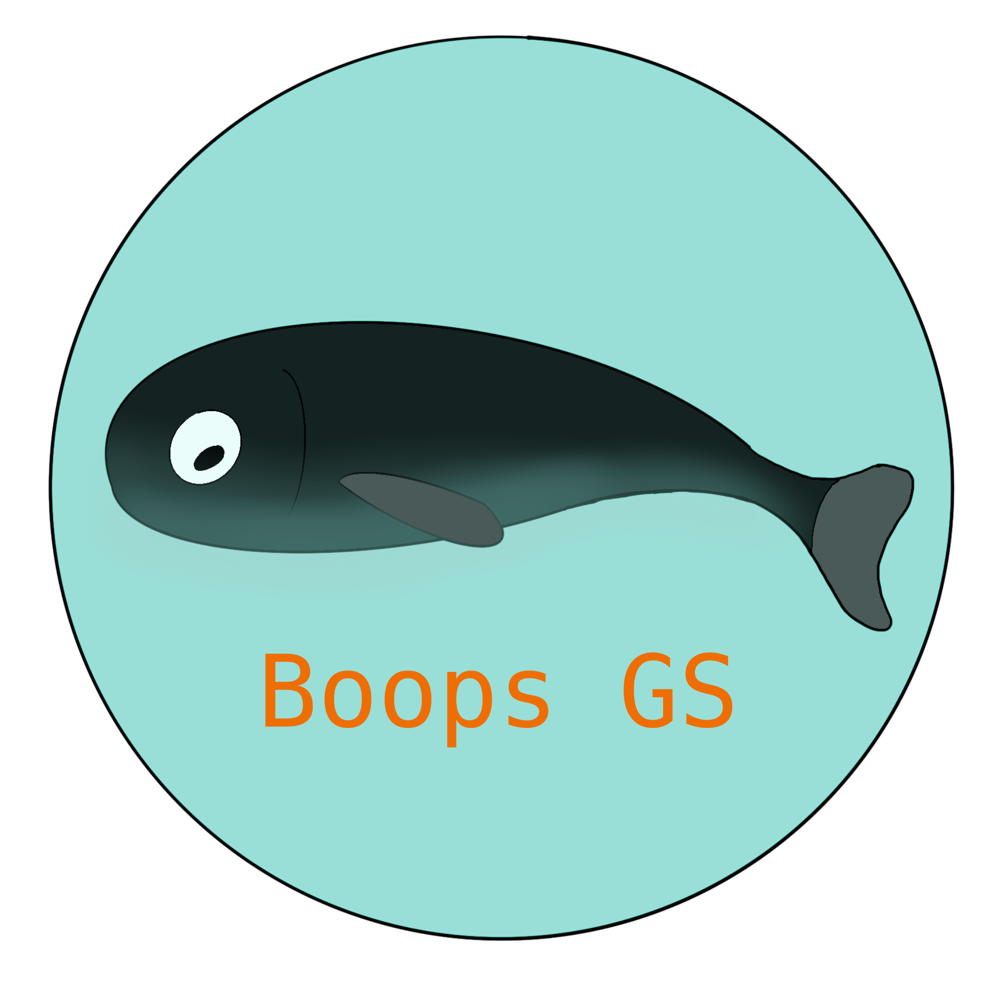

* Twitter: https://twitter.com/Boops_Games
* Instagram: https://www.instagram.com/boopsgamesstudio/
* Itch.io: https://itch.io/profile/boops-games-studio
* Youtube:https://www.youtube.com/channel/UCdlggk1-f6dqdhcsiB29jWA

___

# 1.- Índice

+ __[2.- Introducción](#intro)__
	+ __[2.1 Concepto del juego](#game_concept)__
	+ __[2.2 Características principales](#main_features)__
	+ __[2.3 Género](#genre)__
	+ __[2.4 Propósito y público objetivo](#target)__
	+ __[2.5 Jugabilidad (idea básica)](#basic_gameplay)__
	+ __[2.6 Estilo visual](#visual_style)__
	+ __[2.7 Alcance](#reach)__
	
+ __[3.- Mecánicas de juego](#mechanics)__
	+ __[3.1 Jugabilidad (en profundidad)](#gameplay)__
	+ __[3.2 Flujo de juego](#game_flow)__
	+ __[3.3 Personajes](#characters)__
	+ __[3.4 Movimiento](#movement)__
	
+ __[4.- Interfaz](#interface)__

+ __[5. Arte](#art)__

+ __[6. Sistema de monetización](#money)__

+ __[7. El futuro del proyecto](#future)__

+ __[8. Historial de versiones](#changelog)__

+ __[9. Boops Games Studio](#credits)__

# 2.- Introducción

Este es el documento de diseño de **_Punch'em Up!_**, un videojuego de navegador desarrolado por _Boops Games Studio_.
	
+ ##  2.1 Concepto del juego	

En un puente dos rivales se encuentran y tú quieres evitarlo... Juega como dos puños de madera gigantes e intenta tirar a todo aquel que se atreva a pasar por el puente. ¿Conseguirás la máxima puntuación?
	
+ ## 2.2 Características principales		
	
**Partidas Rápidas e Intensas**: Partidas que duran poco pero de gran intensidad para que el jugador pueda jugar en periodos cortos y pasárselo bien

**Fácil aprendizaje**: Los controles son sencillos, con un botón activas un puño y con otro botón el otro puño. ¡Ya está!

**Variedad**: En cada dificultad habrá más enemigos con distintas habilidades, nunca sabrás lo que te puedes encontrar.

**Divertidos Personajes**: ¡Los dos bandos que luchan entre sí pueden cambiar! Elige los que más te gusten (No disponible por el momento, idea de monetización)
	
+ ## 2.3 Género	
	
Se trata de un juego Arcade.
	
+ ## 2.4 Propósito y público objetivo
	
El propósito general del juego es entretener durante un breve periodo de tiempo para no requerir una dedicación a los jugadores 
y poder abarcar un mayor número de audiencia.

Para todos los públicos, pero enfocado al público joven

+ ## 2.5 Jugabilidad(idea básica)
	
**Puños Gigantes**: El jugador podrá manejarlos, la idea es que cuando algún personaje pase por delante, lo tires.

**Multiples clases**: A medida que se juegue, aparecerán nuevas clases de personajes con habilidades exclusivas.

**Varios niveles**: En cada nivel se introducirán nuevos personajes y la dificultad aumentará.
	
+ ## 2.6 Estilo visual	
	
Animado y Cartoon. El juego va sobre tirar a gente de un puente, así que hemos optado por un estilo más amigable y menos realista que le reste seriedad y añada humor al asunto.
	
+ ## 2.7 Alcance
	
Se trata de un divertido juego para navegadores con un sistema de monetización para el apartado visual.

# 3.- Mecánicas de juego

+ ## 3.1 Jugabilidad (en profundidad)	
	
Varios personajes atravesarán el puente. Tu manejas a dos puños gigantes.

Al pasar por delante de los puños, se pueden activar para tirar a los personajes fuera 	del puente.

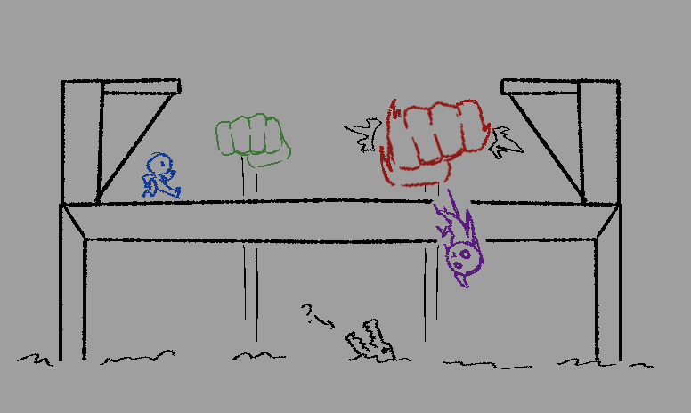

El objetivo del juego es evitar que los personajes crucen el puente. Cuantos más personajes sean tirados, mayor será la 		puntuación.
El juego acaba tras dejar cruzar el puente a demasiados personajes.

El juego auméntara la dificultad según avance el tiempo, siendo más rápidas las oleadas de personajes cruzando y con distintos tipos de personajes. 
También se abrirá el otro lado del puente, pudiendo los personajes cruzar de izquierda a derecha y viciversa. 
	
+ ## 3.2 Flujo de juego	
	
El jugador seleccionará una de las dificultades a elegir en el juego, clasificadas por niveles:

* **Nivel 1**: Aparecerán _Unidades Normales_ y _Unidades a Caballo_. 
* **Nivel 2**: Todo lo anterior y aparecerán _Caballeros Gigantes_ .
* **Nivel 3**: Todo lo anterior y aparecerán _Hechiceros_.

Además, durante la partida la velocidad de los personajes que van por el puente irá aumentando con el tiempo.

Tras elegir el nivel a jugar, se procederá a la partida hasta que el jugador se quede sin vida y vaya a la pantalla de Game Over.
En ella podrá elegir si quiere volver a jugar y mirar si ha superdado la máxima puntuación.

+ ## 3.3 Personajes		
	
Por defecto:

* **Unidad Normal**: Unidad estándar, sin habilidades especiales.
	
* **Unidad a Caballo**: Se mueven más rápido que una unidad estándar.

Exclusivas de _Caballeros_:

* **Caballero Gigante**: Necesita más golpes que una unidad estándar para ser tirado.
	
Exclusivas de _Magos_:

* **Hechicero**: Se teletransporta a la mitad del mapa, esquivando uno de los puños automáticamente.

+ ## 3.4 Movimiento
	
Los personajes se moverán de un lado al otro del puente. Los puños solo se mueven hacia el jugador para tirar a los personajes.

# 4.- Interfaz

+ ## 4.a Diagrama de flujo (Idea inicial)	

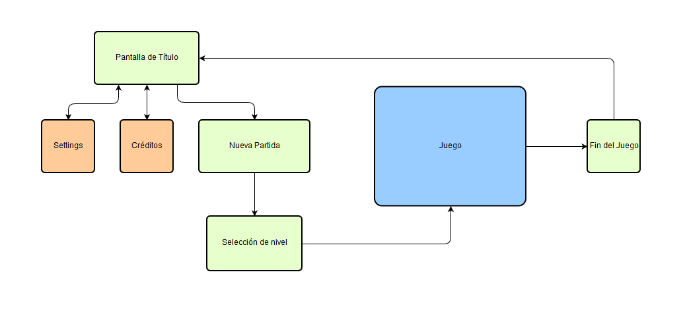

+ ## 4.b Menú principal

  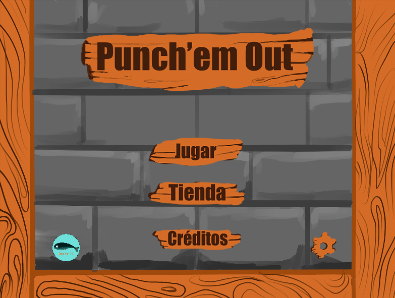

+ ## 4.c Créditos	

  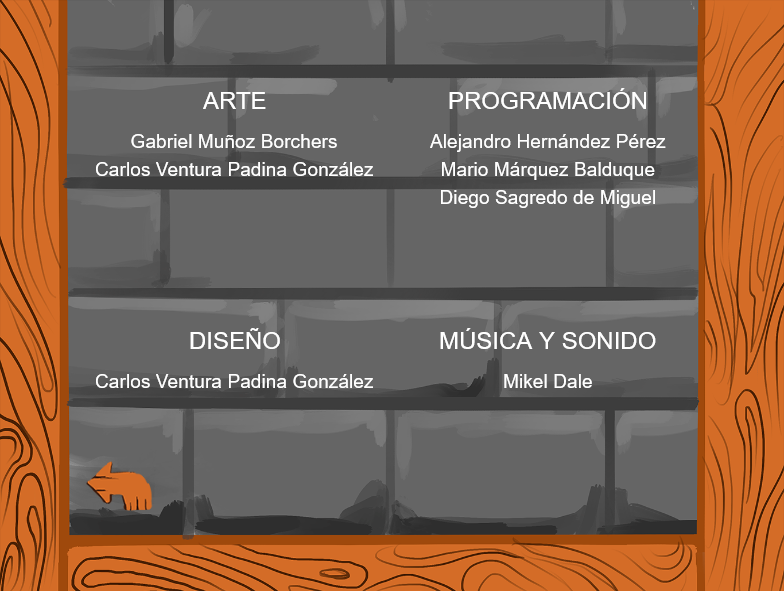

+ ## 4.d Redes sociales

  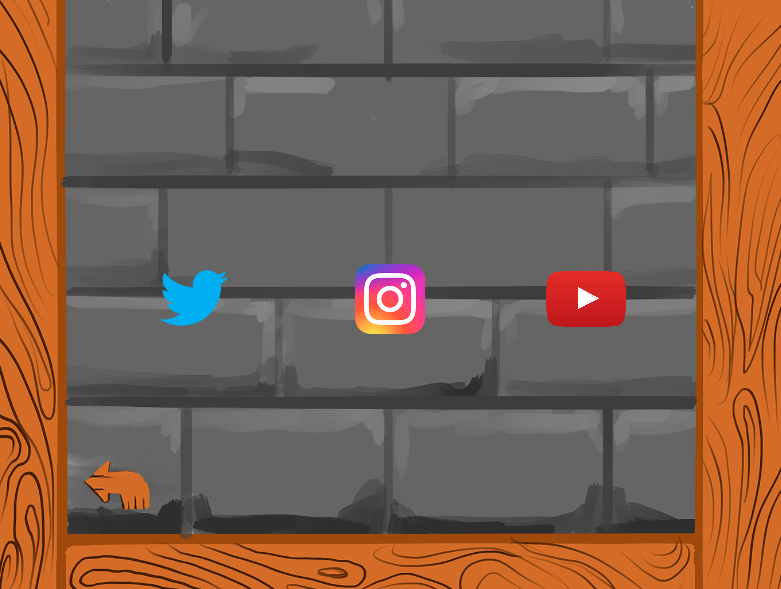

+ ## 4.e Tienda	

  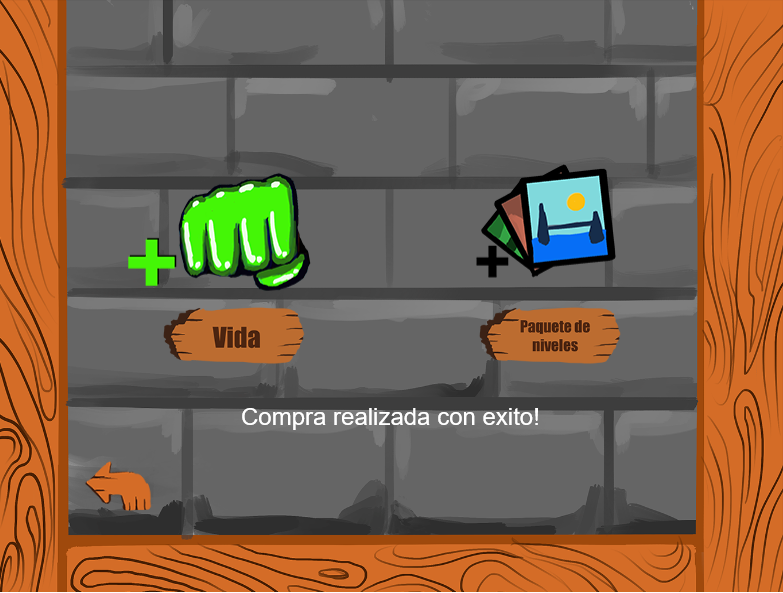

+ ## 4.f Ajustes	

  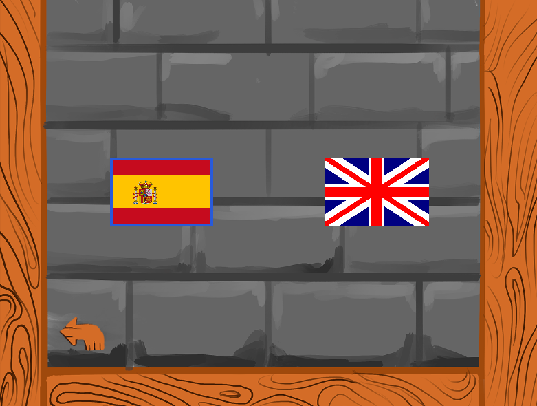

+ ## 4.g Selección de nivel	

  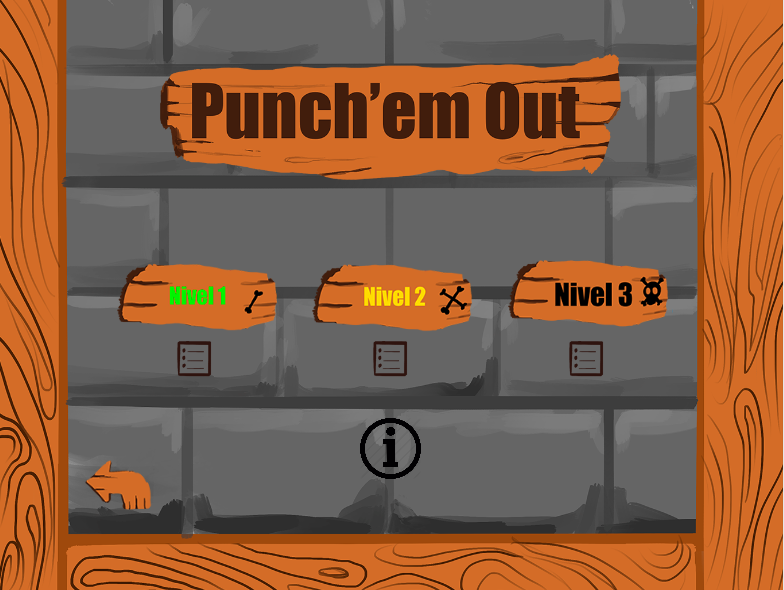

+ ## 4.h Rankings	

  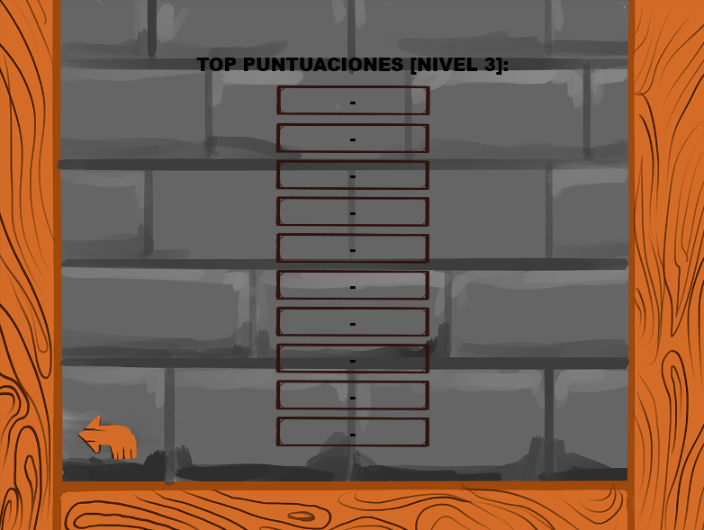

+ ## 4.i Información de los personajes	

  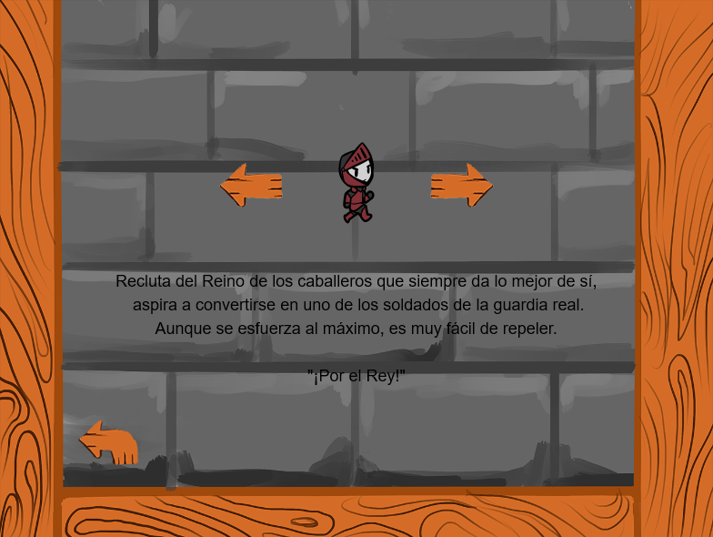

+ ## 4.j Juego	

  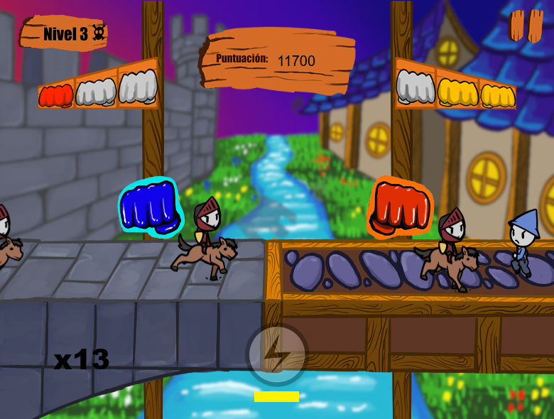

+ ## 4.k Pausa	

  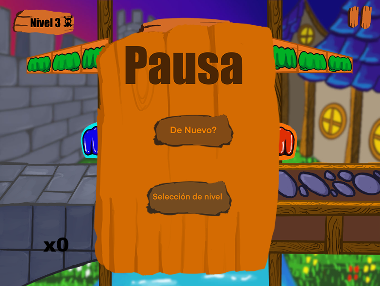

+ ## 4.l Fin del nivel

  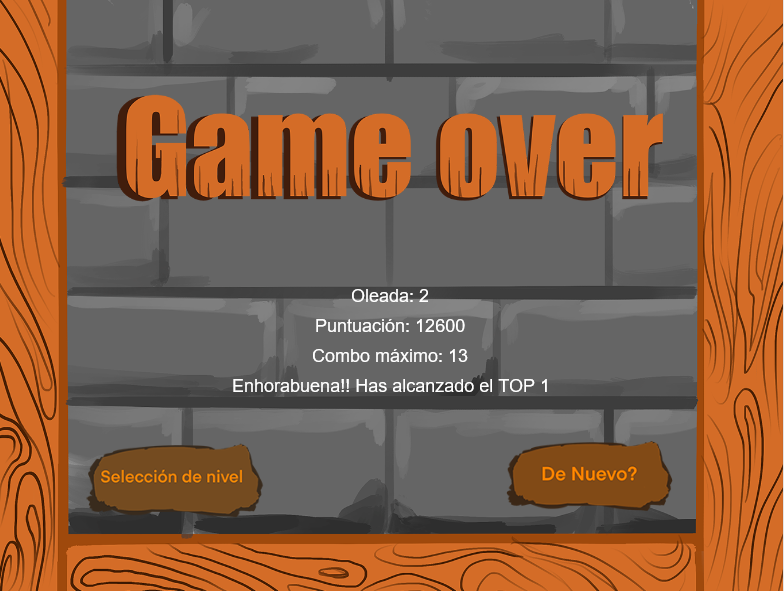

# 5.- Arte 

_Concept Magos y Caballeros 1_

  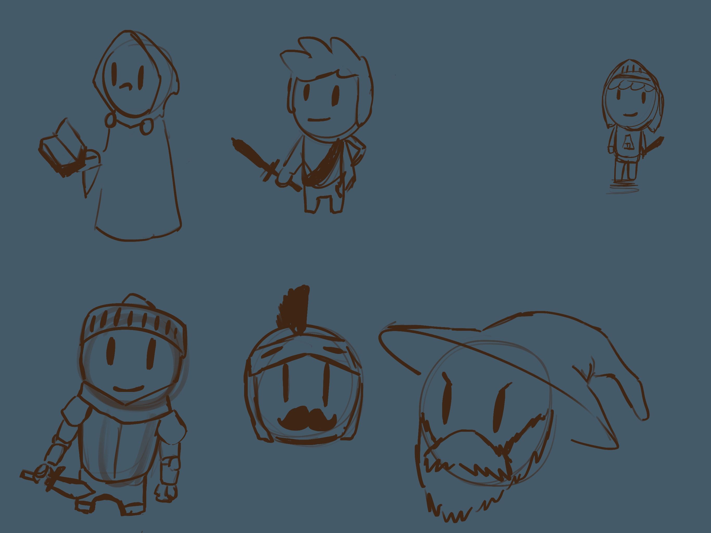

_Concept Magos y Caballeros 2_

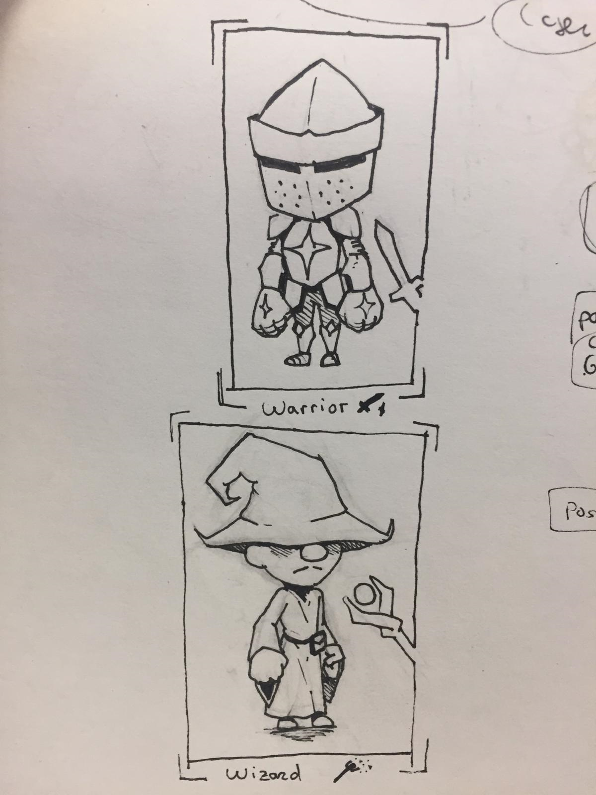

_Concept Magos y Caballeros 3_

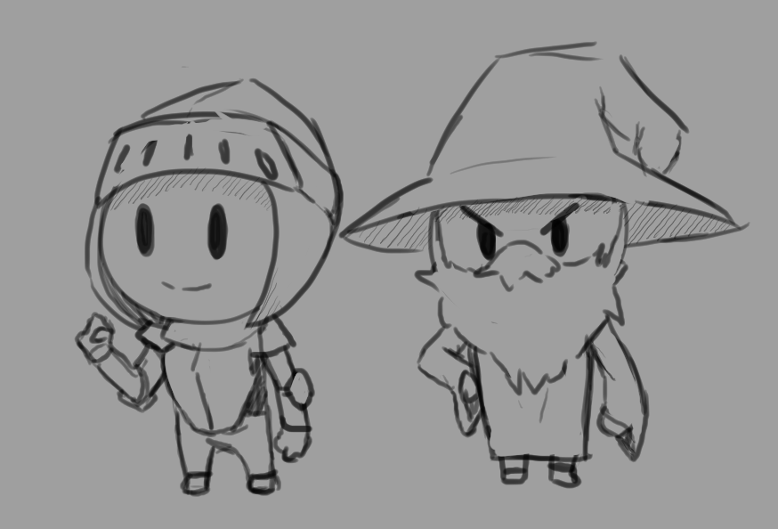

_Concept Magos y Caballeros, Diseño "Final"_

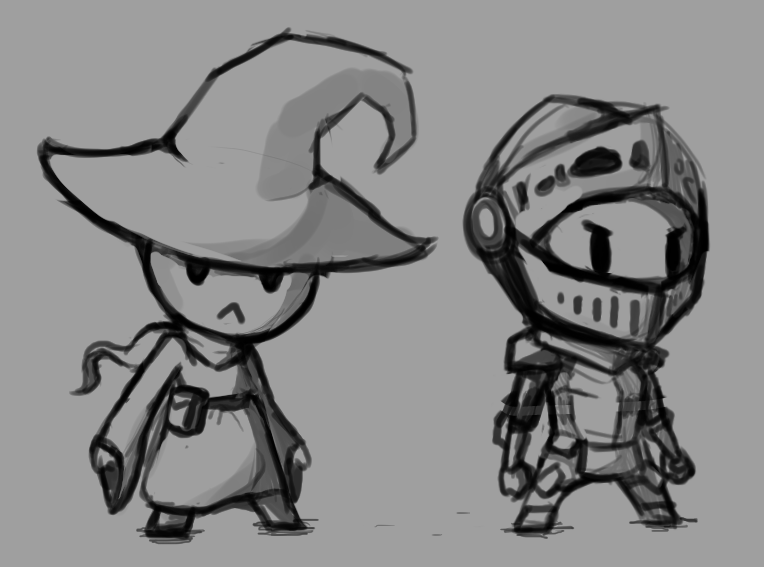

_Sketch de la animación_

_Sketch de la animación del Hechicero_

_Sketch de la animación del Caballero Gigante_

_Sketch de la animación delos jinetes_

_Concept Escenario_

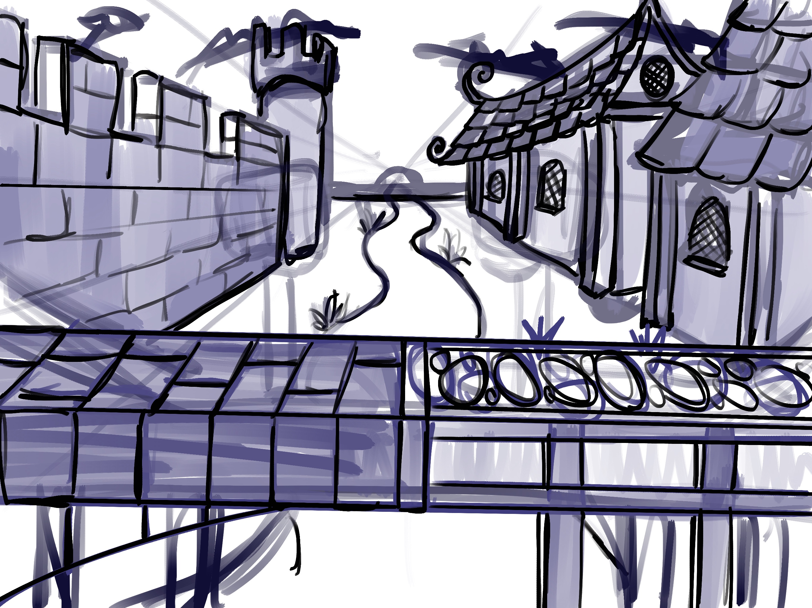

# 6.- Sistema de monetización

Haremos uso de un sistema *freemium*. En la tienda, podremos:

+ **Comprar paquete de niveles**: *2.99€* Con ello, el jugador podrá desbloquear niveles sin necesidad de jugar y conseguir los puntos necesarios.
+ **Comprar una vida:** *0.50€* Con ello el jugador podrá revivir un puño que haya perdido una vez por partida. Con ello, el jugador podrá seguir jugando durante más tiempo.

*Todos los precios aquí puestos son orientativos*

# 7.- El futuro del proyecto

El plan del juego de aquí a dos años el el siguiente:

+ **Seguir actualizando el juego con más niveles:** Se seguirá actualizando el juego añadiendo nuevos niveles, lo que implica nuevos escenarios, enemigos y mecánicas. Los niveles se actualizarán en paquetes de niveles, cada uno reuniendo un número variante de niveles a desbloquear.

  * Nueva estética: Los nuevos niveles tendrán distintas estéticas, siempre con dos bandos enfrentándose. Un ejemplo podría ser Aliens vs Humanos, jugando en una estación espacial o un planeta.
  * Nuevos enemigos: Cada nivel temático tendría sus propios enemigos. Algunos con mecánicas exclusivas. Un ejemplo podría ser un alien que necesita tres golpes, pero que va más lento con cada golpe que le des.
  * Nuevas mecánicas: Mientras la mecánica principal sería la misma, cada nivel puede añadir un nuevo giro de tuerca para hacer el juego más interesante. Un ejemplo de ello puede ser jugar la posibilidad de mover los puños por un rail, pudiendo cambiar su posición, permitiendo abatir nuevos tipos de enemigos.
  
+ **Nuevos Power-ups**: Actualmente el juego tiene un solo power-up. La idea es ampliar el catálogo de power-ups que puede usar el usuario. Un ejemplo de esto sería un power-up que permitiese al jugador ampliar el tamaño de los puños, para aumentar su alcance. 

+ **Más opciones de compra**: Se podrán comprar los paquetes de niveles para desbloquearlos antes de tiempo. Aparte de eso, la idea es que se puedan comprar Power-ups que se vayan diseñando

+ **Seguir actualizando las RRSS:** Para ayudar a la interacción con la comunidad se seguirán actualizando periódicamente las redes sociales, publicando actualizaciones y resolviendo dudas.

+ **Resolver dudas y ayudar al usuario**: Tras la salida del juego, se resolverán las dudas y problemas de los usuarios a través del correo del grupo.

# 8.- Historial de versiones

+ (24/09/2019) Estructura básica del documento.
+ (28/09/2019) Añadidas muchas mejoras:

  * Añadido icono nuevo.
  * Cambiado el "pitch" del juego.
  * Añadidas imágenes para explicar mejor el juego.
  * Añadido Diagrama de Flujo
  * Desarrolladas las secciones de Flujo del Juego y Estilo Visual
  * Mejorada explicación de Jugabilidad, Personajes y Características.
  * Créditos al final del documento y RRSS.
  * Pequeñas mejoras.
  
+  (08/10/2019) Añadidas animaciones al GDD
+  (19/10/2019) Actualizado el GDD para la entrega del proyecto:

   * Añadida sección para explicar la monetización del juego.
   * Añadida sección explicando el futuro del proyecto.
   * Pequeñas mejoras por el documento
  
+ (20/10/19) Añadidas imágenes que faltaban: Listo para entregar

# 9.- Boops Games Studio

+ Alejandro Hernández Pérez -Programador
+ Mario Marquez Balduque - Programador
+ Diego Sagredo de Miguel - Programador
+ Gabriel Muñoz Borchers - Artista/Sonido
+ Carlos Ventura Padina González - Artista/Diseñador
